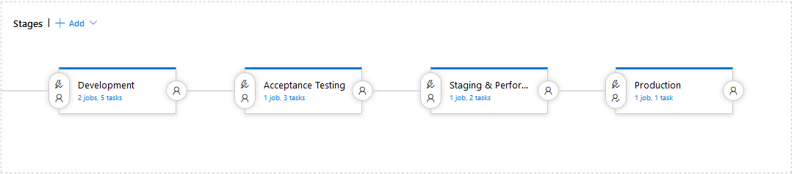

# MSc. in Devops - Continuous Software Delivery
## Continious Assessment 1
### Build & Release Pipeline for a Blood Pressure Application
| Name | Student ID | Email Address |
| ---- | ---------- | ------------- |
| Declan Smyth | x00151293 | declan.smyth@gmail.com |

### Status Information

---
# Implementation of Build & Release Pipeline
## Introduction
The blood pressure calculator application is a .Net Razor application based on Microsoft .Net Core 2.1. It provides a basic calculation of your blood pressure category. The application is developed using the following tools:
* Microsoft Visual Studio 2017
* Azure DevOps
* Microsoft Azure platform for hosting of the website

## Code Design

## Build & Release Design
### Source Code Management
The blood pressure application is stored in a GIT based source code management system from GITHub. GIT a lightweight but powerful decentralised SCM. All code for the project can be found in the [msc-csdca1 repository](https://github.com/declan-smyth/msc-csdca1)

### Build Pipeline
Build services are provided by Azure DevOps. This suite of tools provide Agents and Task for building of applications across multiple platforms.  The build pipeline implements the following funcationality:

1. Initalization & Source Code Download
2. Application Compile
3. Unit Test Execution
4. Code Quality Analysis & Publication
5. Application Publication
6. Build Artifact Publication
7. Agent Cleanup

All builds in this pipeline are run on Microsoft Windows based servers in the VS 2017 Host pool 

The pipeline is designed to build and ut was desinit test the application on a single host. It was primarily designed using the GUI pipeline development interface provided by the Azure Devops environment. A yaml based pipeline was developed using just the Microsoft tasks and committed to the repository.  The build pipelines are called:
* CI-Build-Pipeline   --> This is the pipeline developed using the Visual Designer. 
* YAML Pipeline Build --> This is the simple yaml based pipeline

#### Application Compile, Test and Publish
The application is compiled using the DOTNET Core task. This task has a number of commands will build, test and publish your web applications applications.  Unit testing is completed as part of the build with 50+ tests executed covering 90% of the new code added for the Blood Pressure Category calculations. 

During the development of the pipeline, I found that code coverage was not automatically available in a publishable format as the output from the Test Task produced a binary .coverage file. This file was loaded to the build information and could be downloaded and opened outside of the pipeline.  
**Note:** Code coverage collectors were only added to the DOTNET Core SDK in release 2.1.400 with a limitation that they can only run on Windows based build servers.

#### Code Quality Analysis
Code Analysis is being performed by Sonar Cloud and nDepend. The tools were implemented to view the different experiences of the tools. 

##### Sonar Cloud
The Sonar Cloud project used for code quality analysis is the [msc-cadca1 project ](https://sonarcloud.io/dashboard?id=declan-smyth_msc-csdca1). This tool is linked to the GITHub repository for analysis cand provides information on:
* Bugs
* Code Smells
* Coverage  
The tool provide a widget that is availalbe in the Azure DevOps Dashboard. It is possible to get code coverage information both additional manipulation of the .coverage is required for the information to be available for analysis

##### nDepend
This is a paid for tool that a trial license has been obtained. This tool provides detailed analysis of the code and is tightly coupled with the Azure DevOps environment. Information from this tool includes:
* Quality gates
* Rule Violations
* Technical Debt
* Code Coverage

### Release Pipeline
The release pipeline is developed in Azure DevOps. The release pipeline is linked to the Build Pipeline with artifcates being made available to the release after a successful build has completed. 
The release pipeline is comprised of the following stages:
1. Development
2. Acceptance Test
3. Staging & Performance Test
4. Production

#### Azure Platform 
The Azure platform is used for hosting the web application. The platform provides Web Application resource that will make the application available via a named url. The url for this application is  https://bpcalculator-dev-as.azurewebsites.net

The Azure Platform, also provides deployment slots that are used in the release pipeline to test the web application before it goes into produced.  In this pipeline we deploy a build into the following slots:
* DEV    -> Used for testing of the application in a development environment
* TEST   -> Used for acceptance testing 
* STAGE  -> Used for performance testing of the application

The production slot is main application web URL, we use a slot swap to move from Stage into Production as part of the release pipline

#### Stage: Development
The development pipeline will deploy the application into a Development Slot on the Azure Platform and run a selection of Selenium Tests. The tests are controlled with with a runsettings file that points to the url of the slot to use for testing.

#### Stage: Acceptance Test
The Acceptance Test stage pipeline will deploy the application into a Testing Slot on the Azure Platform and run a selection of Selenium Tests. The tests are controlled with with a runsettings file that points to the url of the slot to use for testing.

This stage also has a post-deployment check to validate that there are no open Severity 1 or Sererity 2 issues open before proceeding to the next stage

#### Stage: Staging & Performance Test
The Staging & Performance Test stage runs a Quick Performance Load test in the staging environment. If the load test passes the web application will result in a pre-approval email being sent for approval for the build to be moved to production

#### Stage: Production
After the release is approved the build is moved into production using a __Slot Swap__ from the Stage Slot.

---
# New Features
To enhance the application the following updates were made to the application
* Blood Pressure Categories at the High end of the scale were made more fine grain. 
These changes are in-line with information from the American Hearth Foundation, where there are additional categories for High Blood Pressure. The additional categories are
  * High Blood Pressure - Stage 1
  * High Blood Pressure - Stage 2
  * Hypertensive Crisis
* An improvement to the display of the calcualtion is placed on screen to improved the overall user experience and highlight the result
* Two new alert messages have been added to provide additional information to the user
  * Warning message for people with High Blood Pressure. This is to encourage them to seek improvements to their lifestyle
  * Danger message to alert the user that the information indicates a medical emergency. This is displayed in the case of Low Pressure and Hypertensive Crisis

---